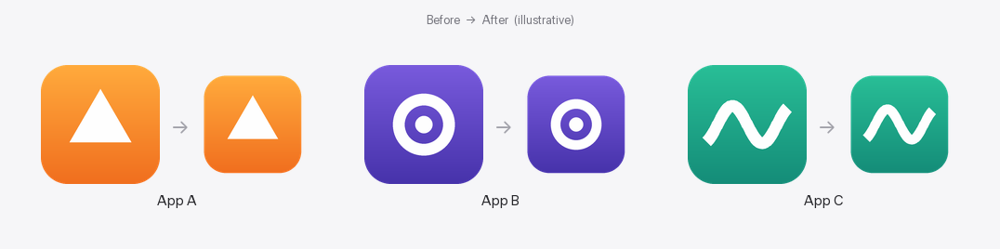
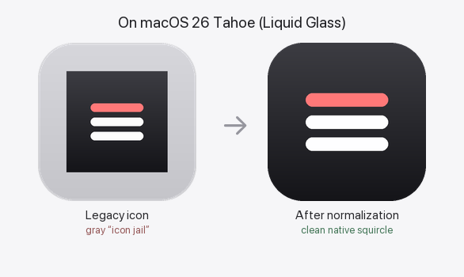

# icon-normalizer

Automatically shrink **oversized macOS app icons** back to the native
proportion, so every app looks consistent in the Dock, Launchpad and Finder.

Some third-party apps — audio plugins, cross-platform tools, vendor utilities —
ship an icon whose artwork fills the **entire** canvas. Next to Apple's icons
(whose art occupies ~82% of the canvas, leaving a transparent margin) these look
noticeably **too big**. `icon-normalizer` finds those apps and rescales their
icon to the native proportion, then keeps them that way — even after app updates.



*Illustrative example (synthetic icons). Left: an icon whose art fills the whole
canvas. Right: rescaled to the native ~82% proportion with a transparent margin.*

---

## What it does

- **Scans** your installed apps (no hard-coded list).
- For each app whose icon fills **≥ 92%** of the canvas, it rebuilds the icon at
  **~82%** (centered, with a transparent margin) and applies it as a **custom
  icon** — using `NSWorkspace.setIcon`, which writes an `Icon␍` resource and
  **does not modify the app bundle's own `.icns` or its code signature**.
- **Re-applies automatically after updates.** App updaters replace the whole
  bundle and wipe the custom icon; a `launchd` daemon watches `/Applications`
  (plus a periodic sweep) and puts the normalized icon back.

### Why it's safe and precise

- **Only user-facing apps.** It gates on the **Launchpad database**, which is the
  reliable signal for "an app that actually shows up" — this cleanly excludes
  installers, uninstallers and background agents (their `Info.plist` and code
  signature look identical to real apps, so those checks alone aren't enough).
- **Apple apps are skipped** (`com.apple.*` bundle id, or an Apple
  `Software Signing` authority).
- **Idempotent.** Apps that already have a custom icon are left alone; icon
  measurements are cached by modification time, so re-scans are cheap.
- **Faithful rescale.** Each icon resolution is derived from the original
  `.icns` representation *at that same size*, not from a single downscaled
  master — so small sizes keep their detail.
- **Reversible.** `--revert` (and the uninstaller) restore the original icons.

---

## Compatibility

- **macOS 15 Sequoia — primary target.** Also expected to work on earlier
  releases (it relies only on long-standing pieces: `iconutil`, `sips`,
  `NSWorkspace.setIcon`, the Launchpad database, `launchd`).

- **macOS 26 Tahoe — works, with two differences:**
  - Launchpad no longer exposes its database, so the Launchpad-based app filter
    can't run; the scanner falls back to `Info.plist` heuristics (`LSUIElement` /
    `LSBackgroundOnly` / nesting) — less precise at excluding installers/helpers,
    but functional.
  - Tahoe's Liquid Glass forces every icon into a squircle, and a legacy
    full-bleed, hard-cornered icon gets dropped into a gray *"icon jail"*
    container. Because this tool re-saves icons with a transparent margin, Tahoe
    masks them into a clean native squircle instead — so the tool's role shifts
    from *resizing* (the system does that now) to *giving Tahoe a maskable icon*.

  

- **macOS 27 Golden Gate** inherits Tahoe's Liquid Glass icon system, so the same
  behavior is expected.

## Requirements

- macOS (Sequoia or Tahoe — see the compatibility note above for how behavior
  differs on Tahoe).
- Xcode **Command Line Tools** (`xcode-select --install`) — provides `python3`,
  `iconutil` and `sips`.
- Admin rights (`sudo`) — most apps in `/Applications` are owned by `root`, and
  the daemon runs as `root` so it can re-apply after updates.

Python dependencies (installed automatically into a private virtualenv):
`Pillow`, `pyobjc-framework-Cocoa`.

---

## Install

```sh
git clone https://github.com/danielh989/macos-icon-normalizer.git
cd macos-icon-normalizer
sudo ./install.sh
```

This installs a copy to `/usr/local/icon-normalizer`, creates a self-contained
virtualenv, runs a first scan, and loads the `launchd` daemon
`com.icon-normalizer.daemon`. From then on it works in the background.

Prefer a different threshold? Pass it at install time:

```sh
sudo ICON_NORMALIZER_THRESHOLD=0.90 ./install.sh
```

---

## Usage

Most of the time you never touch it — it just keeps icons normalized. Manual
commands:

```sh
# Preview what WOULD be normalized, without changing anything:
sudo /usr/local/icon-normalizer/venv/bin/python \
     /usr/local/icon-normalizer/normalizer.py --dry-run

# Force a scan/apply right now:
sudo launchctl kickstart -k system/com.icon-normalizer.daemon

# Restore the original icons this tool applied (keeps the daemon installed):
sudo /usr/local/icon-normalizer/venv/bin/python \
     /usr/local/icon-normalizer/normalizer.py --revert

# Watch the log:
tail -f /usr/local/icon-normalizer/icon-normalizer.log
```

### Configuration

Set via environment variables (bake them in with `install.sh`, or edit the
`EnvironmentVariables` block in
`/Library/LaunchDaemons/com.icon-normalizer.daemon.plist`):

| Variable | Default | Meaning |
| --- | --- | --- |
| `ICON_NORMALIZER_THRESHOLD` | `0.92` | Fill fraction that counts as *oversized*. |
| `ICON_NORMALIZER_CONTENT` | `0.82` | Target fill after normalization. |
| `ICON_NORMALIZER_SCAN_DIRS` | `/Applications` | Colon-separated roots to scan. |

> The default `0.92` deliberately leaves near-native icons untouched (e.g. apps
> whose art fills ~85–91% of the canvas). Lower it toward `0.90` to catch more,
> but be aware you start touching icons that already look fine.

---

## Uninstall

```sh
cd macos-icon-normalizer
sudo ./uninstall.sh              # also restores original icons
sudo ./uninstall.sh --keep-icons # remove the daemon but keep normalized icons
```

---

## How it works (under the hood)

1. **Discover** every `.app` under the scan roots (without descending into
   bundles).
2. **Filter** to Launchpad-visible, non-Apple apps that don't already have a
   custom icon.
3. **Measure** the alpha bounding box of the app's largest icon representation →
   the *fill fraction*.
4. If `fill ≥ threshold`, **rebuild** a normalized `.icns` (per-size, faithful)
   and **apply** it with `NSWorkspace.setIcon(_:forFile:)`.
5. A **`launchd` daemon** (`WatchPaths /Applications` + a 2-hour periodic sweep)
   repeats this, so updated apps get re-normalized automatically.

---

## Limitations

- **"Unidentified developer".** The background item appears in
  *System Settings → General → Login Items & Extensions* as **Icon Normalizer**
  with an "unidentified developer" note. That's expected for any personal
  `launchd` tool — removing it requires signing with a paid Apple Developer ID.
- **Custom art is replaced.** If a future app update ships a *new* icon design,
  the daemon will still normalize it (that's the point). Remove the app from
  scope, lower nothing, or uninstall if you want its new icon verbatim.
- **Deep sub-folder updates** are caught on the periodic sweep (every 2h) rather
  than instantly, since `WatchPaths` only fires on `/Applications` itself.

---

## License

MIT — see [LICENSE](LICENSE).
